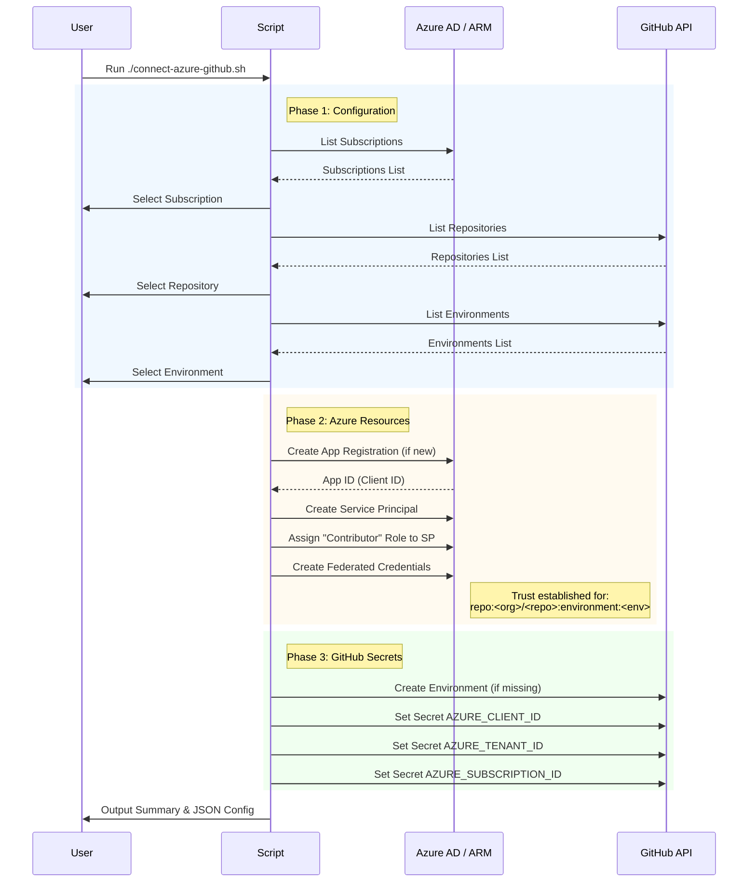

# Azure-GitHub OIDC Connection Script

This script automates the setup of OpenID Connect (OIDC) federation between Microsoft Azure and GitHub Actions. It allows your GitHub Actions workflows to authenticate with Azure without storing long-lived credentials (like Service Principal secrets) in GitHub.

## Purpose

- **Secure Authentication**: Replaces secret-based authentication with OIDC, which uses short-lived tokens.
- **Automated Setup**: Handles the creation of Azure App Registrations, Service Principals, and Federated Credentials.
- **Environment Integration**: Scopes access to specific GitHub environments (e.g., `dev`, `staging`, `prod`).
- **Secret Management**: Automatically pushes the necessary configuration values (`AZURE_CLIENT_ID`, `AZURE_TENANT_ID`, `AZURE_SUBSCRIPTION_ID`) to your GitHub repository's environment secrets.

## Prerequisites

Before running this script, ensure you have the following tools installed and authenticated.

### 1. Azure CLI (`az`)

Required to interact with Azure resources (create App Registrations, Service Principals, etc.).

**Installation:**

*   **macOS** (Homebrew):
    ```bash
    brew update && brew install azure-cli
    ```
*   **Linux** (Ubuntu/Debian):
    ```bash
    curl -sL https://aka.ms/InstallAzureCLIDeb | sudo bash
    ```
    *(For other distros, see the [official docs](https://learn.microsoft.com/en-us/cli/azure/install-azure-cli-linux))*

**Authentication:**
```bash
az login
```

### 2. GitHub CLI (`gh`)

Required to fetch repository information and push secrets.

**Installation:**

*   **macOS** (Homebrew):
    ```bash
    brew install gh
    ```
*   **Linux** (Ubuntu/Debian):
    ```bash
    type -p curl >/dev/null || (sudo apt update && sudo apt install curl -y)
    curl -fsSL https://cli.github.com/packages/githubcli-archive-keyring.gpg | sudo dd of=/usr/share/keyrings/githubcli-archive-keyring.gpg \
    && sudo chmod go+r /usr/share/keyrings/githubcli-archive-keyring.gpg \
    && echo "deb [arch=$(dpkg --print-architecture) signed-by=/usr/share/keyrings/githubcli-archive-keyring.gpg] https://cli.github.com/packages stable main" | sudo tee /etc/apt/sources.list.d/github-cli.list > /dev/null \
    && sudo apt update \
    && sudo apt install gh -y
    ```
    *(For other distros, see the [official docs](https://github.com/cli/cli/blob/trunk/docs/install_linux.md))*

**Authentication:**
```bash
gh auth login
# Select "GitHub.com" -> "HTTPS" -> "Login with a web browser"
```

### 3. Other Dependencies

*   **`jq`**: JSON processor (usually installed by default on many systems, or installed as a dependency of the tools above).
    *   macOS: `brew install jq`
    *   Linux: `sudo apt-get install jq`
*   **Permissions**:
    - **Azure**: Permission to create App Registrations and assign roles (e.g., `Application Administrator` + `User Access Administrator` or `Owner`).
    - **GitHub**: Admin access to the repository to manage environments and secrets.

## Usage

### Interactive Mode (Recommended)

Simply run the script and follow the prompts:

```bash
./sh/connect-azure-github.sh
```

The script will guide you through:
1.  Selecting an Azure Subscription.
2.  Selecting a GitHub Organization and Repository.
3.  Selecting a target GitHub Environment.
4.  Confirming the setup.

### Non-Interactive / Automation Mode

You can also pass arguments directly for automation or documentation purposes:

```bash
./sh/connect-azure-github.sh \
  --subscription "My Azure Subscription" \
  --github-org "my-org" \
  --github-repo "my-repo" \
  --environments "production" \
  --auto-confirm
```

Use `--help` to see all available options:

```bash
./sh/connect-azure-github.sh --help
```

## How It Works



## Output

After successful execution:
1.  **Azure Resources**: An App Registration and Service Principal are created/updated in your Azure tenant.
2.  **GitHub Secrets**: The following secrets are added to your selected GitHub Environment:
    - `AZURE_CLIENT_ID`
    - `AZURE_TENANT_ID`
    - `AZURE_SUBSCRIPTION_ID`
3.  **Local Config**: A JSON summary is saved to `./github-azure-connections/` for your reference.

## GitHub Actions Workflow Example

Once set up, you can use the `azure/login` action in your workflow:

```yaml
name: Azure Deployment

on:
  push:
    branches: [ main ]

permissions:
  id-token: write # Required for OIDC
  contents: read

jobs:
  deploy:
    runs-on: ubuntu-latest
    environment: production # Must match the environment you configured
    steps:
      - name: Azure Login
        uses: azure/login@v1
        with:
          client-id: ${{ secrets.AZURE_CLIENT_ID }}
          tenant-id: ${{ secrets.AZURE_TENANT_ID }}
          subscription-id: ${{ secrets.AZURE_SUBSCRIPTION_ID }}

      - name: Run Azure CLI commands
        run: |
          az account show
          # Your deployment commands here
```
